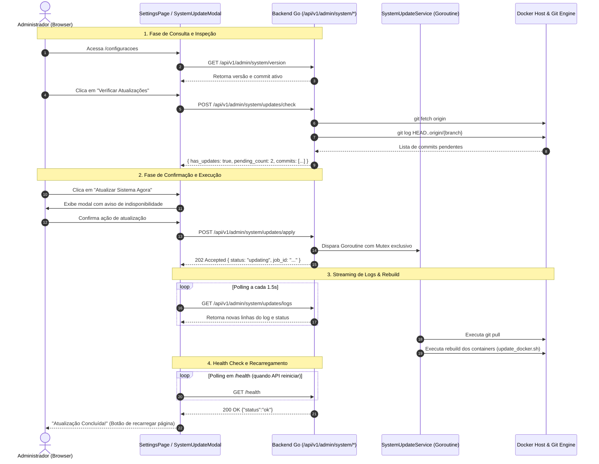

# Atualização do Sistema via Git Pull e Rebuild (Docker)

> **Módulo:** Administração & Manutenção do Sistema  
> **Acesso:** Exclusivo para perfil `admin`  
> **Localização na UI:** Painel de Configurações (`/configuracoes`)  
> **Status:** Especificado / Documentado  

---

## 1. Visão Geral

O módulo de **Atualização do Sistema** permite que administradores do AssetTrack TI verifiquem, inspecionem e apliquem novas atualizações do código-fonte diretamente pela interface web da aplicação, sem a necessidade obrigatória de acessar o terminal SSH do servidor.

O fluxo é composto por:
1. **Verificação de Versão Ativa:** Exibe branch atual, hash do commit e data da última alteração.
2. **Checagem de Atualizações Remotas (`git fetch`):** Compara o estado local com o repositório remoto upstream e lista os novos commits disponíveis com autor, mensagem e data.
3. **Aplicação com Rebuild (`git pull` + Docker Rebuild):** Executa de maneira assíncrona o pull das alterações e a recriação dos containers da aplicação (`update_docker.sh`).
4. **Terminal de Logs em Tempo Real:** Modal interativo que transmite a saída padrão (`stdout`/`stderr`) linha a linha, com rolagem automática e detecção de reativação via polling de `/health`.

---

## 2. Arquitetura e Ciclo de Vida da Atualização



---

## 3. Segurança e Controle de Acesso (RBAC)

| Camada | Mecanismo de Proteção | Comportamento |
|---|---|---|
| **Frontend (React)** | Verificação de Perfil (`currentUser?.role === 'admin'`) | O card de atualização e os botões não são renderizados para técnicos, gerentes, RH ou usuários comuns. |
| **Backend (Gin MW)** | `authMW`, `rActive`, `rAdmin` | Qualquer requisição com token cujo perfil não seja `admin` recebe imediatamente `403 Forbidden`. |
| **Execução de Comandos** | Shell Sanity & Imutabilidade | Nenhum argumento enviado pelo usuário é repassado ao bash. Comandos e scripts são fixos (`git fetch`, `git pull`, `update_docker.sh`). |
| **Concorrência** | `sync.Mutex` no Go | Impede que dois administradores ou múltiplos cliques disparem atualizações ou checagens simultâneas. Retorna `409 Conflict`. |
| **Timeout de Conexão** | `context.WithTimeout` | Limita o tempo de espera de comandos de rede Git para evitar travamento da goroutine em caso de falhas de DNS ou upstream offline. |

---

## 4. Especificação dos Endpoints REST (`/api/v1/admin/system`)

Todos os endpoints abaixo exigem cabeçalho `Authorization: Bearer <TOKEN_JWT>` de um usuário com papel `admin`.

### 4.1. Consultar Versão Atual
`GET /api/v1/admin/system/version`

Retorna os metadados do repositório local corrente.

**Exemplo de Resposta (200 OK):**
```json
{
  "commit_hash": "a8f3b12",
  "full_hash": "a8f3b12c98231d87f9104e123019283746192837",
  "branch": "main",
  "commit_date": "2026-09-28T18:22:10-03:00",
  "commit_message": "feat(kanban): adiciona suporte a filtros por tag",
  "commit_author": "Dev Team",
  "environment": "docker"
}
```

---

### 4.2. Checar Atualizações Remotas
`POST /api/v1/admin/system/updates/check`

Executa `git fetch` e calcula a diferença de commits entre o `HEAD` local e o upstream configurado.

**Exemplo de Resposta (200 OK - Há novidades):**
```json
{
  "has_updates": true,
  "behind_count": 2,
  "current_branch": "main",
  "checked_at": "2026-09-29T10:30:00-03:00",
  "commits": [
    {
      "hash": "c4d12e8",
      "author": "Equipe AssetTrack",
      "date": "2026-09-29T09:15:00-03:00",
      "message": "feat(settings): adiciona botão de atualização automática via git"
    },
    {
      "hash": "b2a90f1",
      "author": "Equipe AssetTrack",
      "date": "2026-09-28T22:40:00-03:00",
      "message": "fix(servicedesk): ajuste na ordenação de chamados por prioridade"
    }
  ]
}
```

**Exemplo de Resposta (200 OK - Sistema Atualizado):**
```json
{
  "has_updates": false,
  "behind_count": 0,
  "current_branch": "main",
  "checked_at": "2026-09-29T10:30:00-03:00",
  "commits": []
}
```

---

### 4.3. Aplicar Atualização
`POST /api/v1/admin/system/updates/apply`

Inicia a execução do processo de atualização em background.

**Exemplo de Resposta (202 Accepted):**
```json
{
  "job_id": "upd-1727616600",
  "status": "running",
  "message": "Processo de atualização iniciado com sucesso."
}
```

**Exemplo de Erro (409 Conflict):**
```json
{
  "error": "Já existe uma atualização ou checagem em andamento."
}
```

---

### 4.4. Acompanhar Status e Logs
`GET /api/v1/admin/system/updates/logs`

Consulta o buffer circular de logs da execução atual.

**Exemplo de Resposta (200 OK):**
```json
{
  "job_id": "upd-1727616600",
  "is_running": true,
  "status": "building",
  "logs": [
    "[10:31:02] Iniciando processo de atualização do AssetTrack TI...",
    "[10:31:03] Executando git pull...",
    "[10:31:05] Atualização do repositório concluída. 2 arquivos alterados.",
    "[10:31:06] Recompilando containers Docker..."
  ],
  "error": ""
}
```

---

## 5. Guia Operacional do Administrador

### 5.1. Como atualizar pela Interface
1. Faça login com uma conta com perfil **Administrador (`admin`)**.
2. No menu superior ou lateral, clique em **Configurações** (`/configuracoes`).
3. Localize o card **Atualização do Sistema (Git & Docker)**.
4. Verifique as informações de branch e commit atual.
5. Clique no botão **"Verificar Atualizações"**:
   - Caso o sistema já esteja na versão mais recente, será exibido o status verde: *"O sistema está atualizado na versão mais recente"*.
   - Caso existam commits novos, uma lista dos commits será expandida informando o autor e resumo de cada alteração.
6. Clique no botão de destaque **"Atualizar Aplicação Agora"**.
7. Leia a mensagem de aviso na janela de confirmação (lembrando que os serviços podem ficar instáveis por alguns segundos) e confirme.
8. Acompanhe no terminal integrado as etapas da atualização.
9. Ao concluir, a interface exibirá a confirmação de sucesso e recarregará automaticamente para carregar a nova versão dos componentes.

---

## 6. Considerações de Infraestrutura & Docker

- **Execução em Container:** Quando o backend roda dentro de um container Docker, ele pode disparar o processo através de um script compartilhado no volume montado ou via comunicação com o Docker daemon do host.
- **Persistência de Dados:** O banco de dados PostgreSQL e os volumes do Redis (`postgres_data`, `redis_data`) não são modificados nem resetados durante o `update_docker.sh`; apenas os containers `api` e `web` são recompilados e recriados.
- **Rollback de Emergência:** Caso ocorra algum erro crítico na compilação, o script mantém os containers anteriores até a validação do health check, permitindo reverter para o commit anterior através de `git reset --hard HEAD~1` pelo terminal host.
