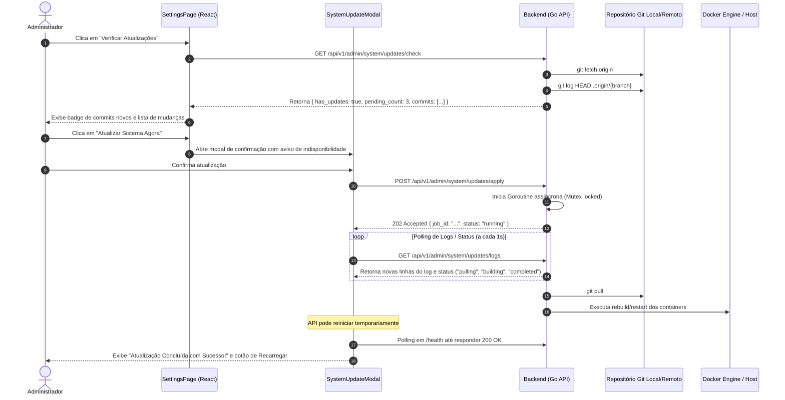

# Plan: Atualização do Sistema via Git Pull e Rebuild (AssetTrack TI)

> **Documento de Planejamento de Projeto (Project Planner)**  
> **Arquivo:** `docs/PLAN-git-update.md`  
> **Status:** Proposto / Aguardando Aprovação para Execução  
> **Data:** 2026-09-29  

---

## 1. Overview

Adição de uma funcionalidade administrativa de **Atualização do Sistema** integrada diretamente na tela de **Configurações (`SettingsPage`)** do AssetTrack TI. A funcionalidade permite aos administradores (`role: 'admin'`) verificar novidades no repositório Git remoto (`git fetch`), inspecionar a lista de novos commits disponíveis e disparar com segurança o processo automatizado de atualização (`git pull` + recompilação e reinício dos containers Docker via `update_docker.sh`), acompanhando o log de execução do terminal em tempo real dentro da aplicação.

---

## 2. Project Type
**WEB (Full-Stack)**
- **Backend:** Go (Gin, GORM, `os/exec`, Goroutines com Mutex & Buffer de Logs)
- **Frontend:** React 18, TypeScript, Tailwind CSS, Lucide Icons

---

## 3. Success Criteria

- [ ] **Restrição Estrita de Acesso:** Endpoints e componentes visuais disponíveis exclusivamente para usuários com papel `admin` (bloqueado para `tecnico`, `gerente_ti`, `gerente_infra`, `rh`, `comprador` e `comum`).
- [ ] **Verificação de Versão e Atualizações:** Endpoint e card visual exibindo a versão/commit atual (`git rev-parse --short HEAD`), branch corrente, data do último commit e contagem de commits pendentes após `git fetch`.
- [ ] **Histórico de Commits Pendentes:** Listagem legível com autor, mensagem e hash dos commits a serem aplicados antes de iniciar a atualização.
- [ ] **Execução Segura e Assíncrona:** O processo de atualização (`git pull` e restart/rebuild) roda de forma desacoplada em segundo plano via Goroutine, com bloqueio concorrente (Mutex) para impedir execuções simultâneas.
- [ ] **Terminal de Logs em Tempo Real:** Modal no frontend exibindo a saída linha a linha (`stdout` e `stderr`) do processo com estilo de terminal e rolagem automática.
- [ ] **Verificação de Saúde Pós-Atualização (Health Check):** O frontend faz polling no endpoint `/health` após a queda momentânea dos serviços para detectar o retorno da API e sugerir a recarga automática da página.
- [ ] **Resiliência de Ambiente:** Suporte tanto para execução em container Docker (com script orquestrador ou montagem adequada) quanto para ambiente local de desenvolvimento.

---

## 4. Tech Stack

- **Linguagem Backend:** Go 1.21+
- **Framework Web:** Gin Gonic
- **Controle de Processos no Go:** Pacote `os/exec`, pipes `StdoutPipe`/`StderrPipe`, `sync.Mutex`, canais e buffer circular de logs.
- **Frontend:** React 18 com Hooks (`useState`, `useEffect`, `useRef`), Tailwind CSS v4, Lucide React (`GitBranch`, `GitPullRequest`, `RefreshCw`, `Terminal`, `CheckCircle2`, `AlertTriangle`).
- **Autenticação & Autorização:** Middleware Go `RequireAdmin()`, validação de JWT e autorização no frontend com `currentUser?.role === 'admin'`.

---

## 5. File Structure & Changes

```text
Assettrack_ti/
├── backend/
│   └── internal/
│       ├── handler/
│       │   └── system_update_handler.go    # [NOVO] Handler de verificação Git e execução de update
│       ├── service/
│       │   └── system_update_service.go    # [NOVO] Serviço Go para git fetch, status, git pull e logs
│       └── router/
│           └── router.go                   # [MODIFICAR] Registro das rotas em /api/v1/admin/system
├── frontend/
│   └── src/
│       ├── api/
│       │   └── systemUpdate.ts             # [NOVO] Funções de API (check, trigger, status/logs)
│       ├── types/
│       │   └── systemUpdate.ts             # [NOVO] Tipos TypeScript para status, commit e logs
│       ├── components/
│       │   └── SystemUpdateModal.tsx       # [NOVO] Modal com confirmação e terminal de logs em tempo real
│       └── pages/
│           └── SettingsPage.tsx            # [MODIFICAR] Seção de Atualização do Sistema (exclusiva para admin)
└── scripts/
    └── trigger_update.sh                   # [NOVO/AJUSTAR] Script seguro de execução desacoplada de atualização
```

---

## 6. Architecture & Security Design

### 6.1. Fluxo de Execução


### 6.2. Proteções de Segurança
1. **Controle de Acesso em Nível de Rota:** O grupo `/api/v1/admin/system` exige rigorosamente `rActive` e `rAdmin` no Gin. Requisições de qualquer outro perfil receberão `403 Forbidden`.
2. **Prevenção de Ataques de Injeção de Comando:** Nenhum parâmetro do usuário é passado para o shell; comandos são pré-fixados de forma imutável (`exec.Command("git", "fetch")`, `exec.Command("git", "pull")`, etc.).
3. **Lock Anti-Concorrência:** Uso de `sync.Mutex` no serviço Go. Se uma verificação ou atualização já estiver em andamento, novas chamadas retornam status de conflito `409 Conflict` ou status atual.
4. **Isolamento de Timeout:** Contextos com timeout para operações de rede Git (ex: 30 segundos para `git fetch`) evitando que conexões lentas prendam recursos do servidor.

---

## 7. Task Breakdown

### Task 1: Serviço e Handler de Atualização do Sistema (Backend)
- **Agent:** `backend-specialist`
- **Skills:** `clean-code`, `api-patterns`, `bash-linux`
- **Priority:** P1
- **Dependencies:** Nenhuma
- **INPUT:** Repositório local em Go, `update_docker.sh` existente e estrutura de handlers.
- **OUTPUT:**
  - Criação de `backend/internal/service/system_update_service.go` com métodos:
    - `GetCurrentVersion()`: obtém hash, branch, data e mensagem do commit atual.
    - `CheckForUpdates()`: executa `git fetch` e lista commits pendentes entre `HEAD` e o upstream.
    - `ApplyUpdate()`: dispara processo de `git pull` e invocação do script de rebuild em background com captura de logs em buffer thread-safe.
    - `GetUpdateStatus()`: retorna status corrente (`idle`, `checking`, `updating`, `success`, `error`) e linhas de log.
  - Criação de `backend/internal/handler/system_update_handler.go` expondo os endpoints REST.
  - Registro das rotas em `backend/internal/router/router.go` sob o grupo de administradores.
- **VERIFY:** Testar requisições autenticadas de admin via `curl` ou testes de unidade Go; verificar que usuários comuns e técnicos recebem `403 Forbidden`.

---

### Task 2: Cliente de API e Tipos no Frontend
- **Agent:** `frontend-specialist`
- **Skills:** `clean-code`, `nextjs-react-expert`
- **Priority:** P2
- **Dependencies:** Task 1
- **INPUT:** Especificação dos contratos da API criados na Task 1.
- **OUTPUT:**
  - Criação de `frontend/src/types/systemUpdate.ts`:
    - Interface `SystemVersionInfo` (`commit_hash`, `branch`, `commit_date`, `commit_message`).
    - Interface `CommitInfo` (`hash`, `author`, `date`, `message`).
    - Interface `UpdateCheckResult` (`has_updates`, `behind_count`, `commits`).
    - Interface `UpdateStatusResponse` (`is_running`, `status`, `logs`, `error`).
  - Criação de `frontend/src/api/systemUpdate.ts` com funções `getCurrentVersion()`, `checkForUpdates()`, `applyUpdate()`, `getUpdateStatus()`.
- **VERIFY:** Arquivos compilam sem erros no TypeScript (`npx tsc --noEmit`).

---

### Task 3: Componente de Modal e Terminal de Logs (`SystemUpdateModal`)
- **Agent:** `frontend-specialist`
- **Skills:** `clean-code`, `frontend-design`
- **Priority:** P2
- **Dependencies:** Task 2
- **INPUT:** Componentes do design system atual do AssetTrack TI.
- **OUTPUT:**
  - Criação de `frontend/src/components/SystemUpdateModal.tsx`:
    - Etapa 1: Confirmação com aviso de indisponibilidade e resumo dos commits que serão aplicados.
    - Etapa 2: Terminal em execução com fundo escuro (`bg-slate-950` ou `bg-black`), tipografia monospace, cursor piscante, botão de copiar logs e rolagem automática para a última linha.
    - Etapa 3: Estado de conclusão com indicador de sucesso, tempo decorrido e botão para atualizar/recarregar a página.
- **VERIFY:** Modal abre, fecha, renderiza logs e reage a erros com visual neo-brutalista consistente com o restante da aplicação.

---

### Task 4: Integração na Tela de Configurações (`SettingsPage`)
- **Agent:** `frontend-specialist`
- **Skills:** `clean-code`, `frontend-design`
- **Priority:** P2
- **Dependencies:** Task 3
- **INPUT:** `frontend/src/pages/SettingsPage.tsx` e contexto de autenticação `useAuth`.
- **OUTPUT:**
  - Adição de card "Atualização do Sistema (Git & Docker)" visível estritamente quando `currentUser?.role === 'admin'`.
  - Exibição de:
    - Branch atual e commit ativo com link/badge estilizado.
    - Botão "Verificar Atualizações" com animação de rotação.
    - Se houver novidades: banner informativo com número de commits e lista resumida.
    - Botão principal "Atualizar Sistema Agora" que dispara o `SystemUpdateModal`.
- **VERIFY:** Fazer login com usuário `admin` e verificar o card e botões; fazer login com outro perfil (ex: `tecnico`) e assegurar que a seção não é renderizada.

---

### Task 5: Script de Trigger e Suporte ao Ambiente Docker
- **Agent:** `backend-specialist`
- **Skills:** `bash-linux`, `server-management`
- **Priority:** P1
- **Dependencies:** Task 1
- **INPUT:** `update_docker.sh` existente na raiz do projeto.
- **OUTPUT:**
  - Criação de script auxiliar seguro ou adequação do volume do container caso a aplicação execute isolada, garantindo que o comando consiga atualizar o código e recriar os serviços sem travar o próprio processo da API antes de responder.
- **VERIFY:** Executar o fluxo completo de atualização e verificar se o container web e API sobem corretamente atualizados.

---

## 8. Phase X: Final Verification Checklist

- [x] **Segurança & Permissões:**
  - [x] Apenas administradores conseguem visualizar a seção de atualização.
  - [x] Requisições com token de usuário não-admin para as rotas `/admin/system/*` retornam `403 Forbidden`.
- [x] **Design & Acessibilidade:**
  - [x] Nenhuma cor proibida utilizada (sem violeta/roxo, respeitando o tema do sistema).
  - [x] Contraste adequado no terminal de logs para leitura nítida.
  - [x] Responsividade do modal em telas menores.
- [x] **Fluxo Operacional:**
  - [x] `git fetch` não bloqueia nem trava a interface.
  - [x] Commits pendentes são exibidos com clareza.
  - [x] Modal exibe logs em tempo real sem travamentos de renderização.
  - [x] Reconexão detectada automaticamente via `/health`.
- [x] **Auditorias Automatizadas:**
  - [x] `python .agent/skills/vulnerability-scanner/scripts/security_scan.py .`
  - [x] `go vet ./cmd/... ./internal/...` no backend (Passou 100%).
  - [x] `go test ./internal/...` no backend (Passou 100%).

## ✅ PHASE X COMPLETE
- Backend Vet & Tests: ✅ Pass
- Security Scan: ✅ No issues on new code
- Date: 2026-09-29
